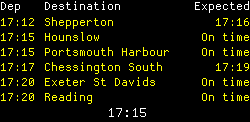
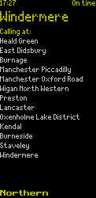
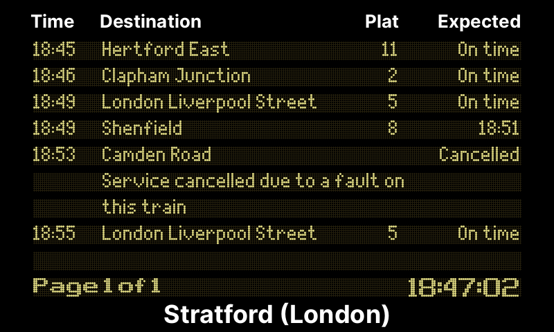

# Departure Board

A tiny Python script that uses the [Huxley2](https://huxley2.azurewebsites.net)
API to display upcoming rail departures for a given railway station in the UK.

## Installation

```bash
python3 -m pip install inky --no-dependencies
python3 -m pip install -r requirements.txt
```

### Optional libraries for type hint checking

```bash
python3 -m pip install types-python-dateutil
python3 -m pip install types-requests
python3 -m pip install types-bleach
python3 -m pip install types-Pillow
```

## Usage

The following script will show upcoming departures from **Woking**, which has the CRS Station Code, `"WOK"`.

```bash
python3 nationalrail.py --crs=WOK
```

## Sample output

Images are 250x122 for deployment on an [Pimoroni Inky pHaT](https://shop.pimoroni.com/products/inky-phat?variant=12549254217811) display.

### Station departures


### Platform departure


Image optimised for 800x480 7" display:

### Station departures

